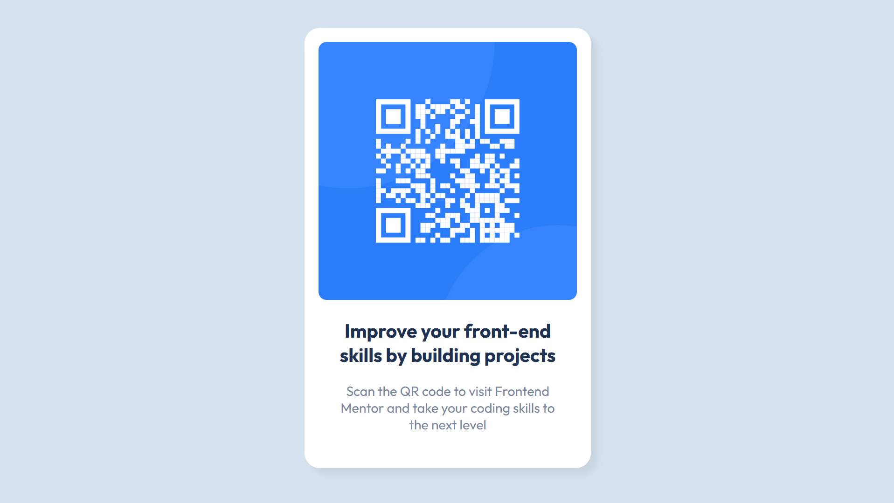

# Frontend Mentor - QR code component solution

This is a solution to the [QR code component challenge on Frontend Mentor](https://www.frontendmentor.io/challenges/qr-code-component-iux_sIO_H). Frontend Mentor challenges help you improve your coding skills by building realistic projects. 

### Screenshot

### Links

- [Solution URL](https://github.com/talithafrsc/frontend-mentor-challenge/tree/main/qr-code-component-main)
- [Live Site URL](https://frsc-qr-code-component.vercel.app/)

## My process

- Create HTML template
- Add CSS for desktop & mobile browsers

### Built with

- HTML5
- CSS custom properties & grid

## Author

- Frontend Mentor - [@talithafm](https://www.frontendmentor.io/profile/talithafm)
